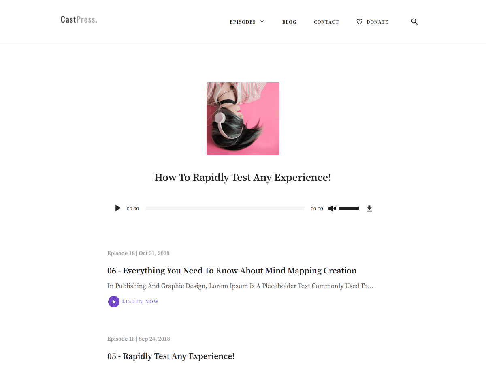

# Castpress - [Demo](https://demo.vitathemes.com/castpress/)

Castpress is a minimal & mobile-first theme. The best choice for people who want to introduce their projects.



## Features

- Sass for stylesheets
- Compatible with [Contact Form 7](https://wordpress.org/plugins/contact-form-7/)
- Theme options built directly into WordPress native live theme customizer
- Responsive design
- Cross-browser compatibility
- Custom Google WebFonts
- Child themes support
- Developer friendly extendable code
- Translation ready (with .POT files included)
- SEO optimized
- GNU GPL version 2.0 licensed
- Support 1 level menu
- …and much more

See a working example at [demo.vitathemes.com/castpress](https://demo.vitathemes.com/castpress/).

## Theme installation

1. Simply install as a normal WordPress theme and activate.
2. In your admin panel, navigate to `Appearance > Customize`.
3. Put the finishing touches on your website by adding a logo, typography settings, custom colors and etc.

## Theme structure

```shell
themes/castpress/                 # → Root of your theme
│── assets/                      # → Theme internal assets
│   ├── css/                     # → Compressed css file
│   ├── fonts/                   # → Theme default fonts ( Customizable from kirki )
│   ├── images/                  # → Theme compressed images
│   ├── js/                      # → Theme Minified javascript files
│   └── src/                     # → Theme source files
├── classes/                     # → Custom PHP classes
├── inc/                         # → Theme functions
│   ├── tgmpa/                   # → Tgmpa plugin recommendation
│   ├── customizer.php           # → All codes related to WordPress Customizer (We use Kirki Framework)
│   ├── custom-header.php           # → All codes related to WordPress Customizer (We use Kirki Framework)
│   ├── template-functions.php   # → Custom template tweaks
│   └── template-tags.php        # → Custom template tags
│   └── setup.php                # → Theme Setup
├── language/                    # → Theme Language files
├── page-template/               # → Theme Part files (Include) - Pages
├── template-parts/              # → Theme Part files (Include)
├── node_modules/                # → Node.js packages
├── package.json                 # → Node.js dependencies and scripts
```

## Theme setup

Edit `functions.php` to enable or disable theme features, setup navigation menus, post thumbnail sizes, and sidebars.

## Theme development

- Run `npm install` from the theme directory to install dependencies
- Run `gulp` from the root of theme directory and it's starting to watch any changes in scss files from the `sass` folder

## Changelog

See the [Changelog](CHANGELOG.md)

## License

Castpress is licensed under [GNU GPL](LICENSE).
