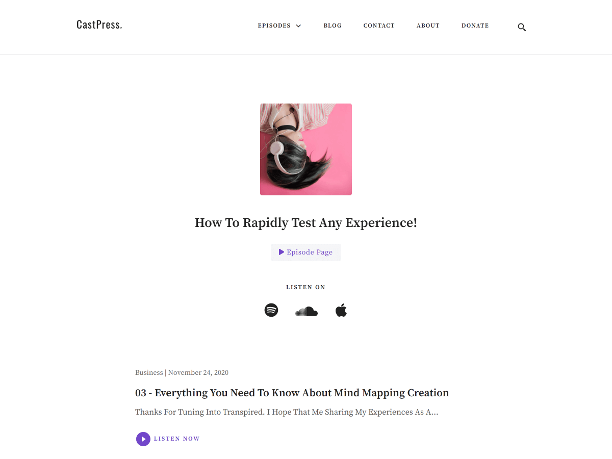

# Castpress - [Demo](https://demo.vitathemes.com/castpress/)

Castpress is a a minimal & mobile-first theme. The best choice for people who want to publish their podcasts.



## Features

- Sass for stylesheets
- Compatible with [Contact Form 7](https://wordpress.org/plugins/contact-form-7/)
- Compatible with [Newsletter](https://wordpress.org/plugins/newsletter/)
- Theme options built directly into WordPress native live theme customizer
- Responsive design
- Cross-browser compatibility
- Custom Google WebFonts
- Child themes support
- Developer friendly extendable code
- Translation ready (with .POT files included)
- SEO optimized
- GNU GPL version 3.0 licensed
- Support 3 level sub-menu
- …and much more

See a working example at [demo.vitathemes.com/castpress](https://demo.vitathemes.com/castpress/).

## Theme installation

1. In your admin panel, go to Appearance > Themes and click the Add New button.
2. Click Upload Theme and Choose File, then select the theme's .zip file. Click Install Now.
3. Click Activate to use your new theme right away.
4. Active Recommended plugins at the top of dashboard ( `Kirki Customizer Framework` , `Advanced Custom Fields` , `LibWp` , `Podcast importer`).
5. After libWp plugin activated go to `Settings > Permalink` and select `Post name` (\*this option is recommended) radio button and save the changes.
6. For importing podcasts you have to activate `Podcast importer` plugin and go to `Tools > Podcast importer` and insert your Rss feed that contains podcasts. Also you can manually add new episodes.
   1. (Hint) if you check `Use an embed audio player instead of the default WordPress player (depending on your podcast host)` in podcast importer you will not able to edit imported podcasts audio file and
      download link because this option will use an external player ( For example spreaker player )
7. For adding custom page-templates (Like Home) go to pages on the WordPress dashboard click on `Pages` create new page and in `Page Atrributes` panel select page template that you want.
8. If you want to add a heart icon before WordPress menu navigation ( Like Demo ) go to `Appearance > Menus` and at the top select `Screen Options` and check `CSS Classes`. after that in menu item that you want, simply write a `heart` in CSS Classes input box.

## Theme structure

```shell
themes/castpress/                # → Root of your theme
│── acf-json/                    # → Theme custom fields json
│── assets/                      # → Theme internal assets
│   ├── css/                     # → Compressed css file
│   ├── fonts/                   # → Theme default fonts ( Customizable from kirki )
│   ├── images/                  # → Theme compressed images
│   ├── js/                      # → Theme Minified javascript files
│   └── src/                     # → Theme source files
├── classes/                     # → Custom PHP classes
├── inc/                         # → Theme functions
│   ├── tgmpa/                   # → Tgmpa plugin recommendation
│   ├── customizer.php           # → All codes related to WordPress Customizer (We use Kirki Framework)
│   ├── custom-header.php        # → All codes related to WordPress Customizer (We use Kirki Framework)
│   ├── template-functions.php   # → Custom template tweaks
│   └── template-tags.php        # → Custom template tags
│   └── setup.php                # → Theme Setup
├── language/                    # → Theme Language files
├── page-template/               # → Theme Part files (Include) - Pages
├── template-parts/              # → Theme Part files (Include)
├── node_modules/                # → Node.js packages
├── package.json                 # → Node.js dependencies and scripts
```

## Theme setup

Edit `functions.php` to enable or disable theme features, setup navigation menus, post thumbnail sizes, and sidebars.

## Theme development

- Run `npm install` from the theme directory to install dependencies
- Change browserSyncTask from `castpress.local/` to whatever address that your project folder is
- Run `gulp` from the root of theme directory and it's starting to watch any changes in scss files from the `sass` folder

## Changelog

See the [Changelog](CHANGELOG.md)

## License

Castpress is licensed under [GNU GPL Version 3](LICENSE).
